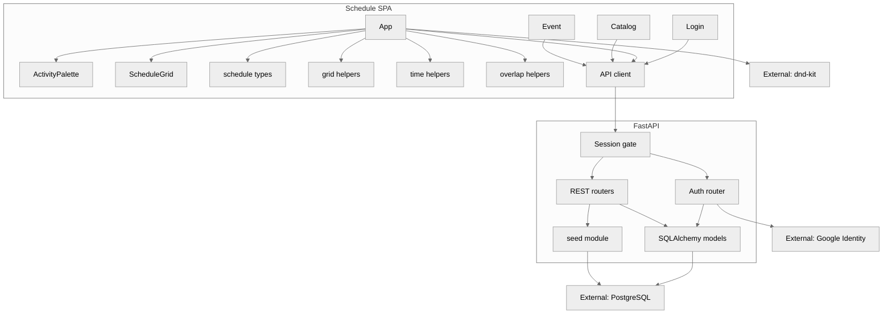

# Component (C4 level 3)

Logical components of the Schedule SPA and API. Grid UI lives in [`frontend/src/App.tsx`](../../frontend/src/App.tsx); venue catalog in [`frontend/src/Catalog.tsx`](../../frontend/src/Catalog.tsx); event setup in [`frontend/src/EventPage.tsx`](../../frontend/src/EventPage.tsx); sign-in in [`frontend/src/Login.tsx`](../../frontend/src/Login.tsx).

## Data in memory

`ScheduleState` is still the SPA model: event metadata, buildings, floors, rooms, activities, time blocks, and allocations. It is loaded from `GET /api/v1/events/{id}/schedule` and mutated through allocation endpoints. Allocations remain one row per room even when adjacent rooms are drawn as one merged block. Group move, resize, and delete persist in one request (`POST .../allocations/bulk-patch` and `POST .../allocations/bulk-delete`) so sibling rooms in a merged run cannot 409 each other or persist only some of the edits.

Session restore is `GET /api/v1/auth/me`. A 401 sends the SPA to `#/login`.

## UI modes

- **Login:** hash route `#/login` — Continue with Google; optional dev email sign-in when `ENABLE_DEV_AUTH=true`
- **Normal:** time on Y, rooms on X, building/floor as column headers
- **Transposed:** rooms on Y, time on X, building/floor as row-spanning bands
- **Catalog:** hash route `#/catalog` for buildings, floors, and rooms
- **Event:** hash route `#/event` for creating/editing an event, its activities, and time blocks
