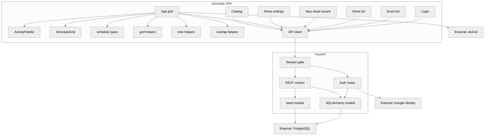

# Component (C4 level 3)

Logical components of the Schedule SPA and API. Grid UI lives in [`frontend/src/App.tsx`](../../frontend/src/App.tsx); venue catalog in [`frontend/src/Catalog.tsx`](../../frontend/src/Catalog.tsx); Event labels in [`frontend/src/EventPage.tsx`](../../frontend/src/EventPage.tsx); sheet list / wizard / settings in [`frontend/src/SheetsPage.tsx`](../../frontend/src/SheetsPage.tsx), [`frontend/src/NewSheetPage.tsx`](../../frontend/src/NewSheetPage.tsx), and [`frontend/src/SheetSettings.tsx`](../../frontend/src/SheetSettings.tsx); sign-in in [`frontend/src/Login.tsx`](../../frontend/src/Login.tsx).

## Data in memory

`ScheduleState` is the SPA model for one **sheet**: Event label, sheet clock and `includedRoomIds`, buildings/floors/rooms from the **current** catalog for those ids, activities, time blocks, and allocations. It is loaded from `GET /api/v1/sheets/{id}/schedule` and mutated through sheet-scoped allocation endpoints. Allocations remain one row per room even when adjacent rooms are drawn as one merged block. Group move, resize, and delete persist in one request (`POST .../sheets/{id}/allocations/bulk-patch` and `POST .../sheets/{id}/allocations/bulk-delete`) so sibling rooms in a merged run cannot 409 each other or persist only some of the edits.

Session restore is `GET /api/v1/auth/me`. A 401 sends the SPA to `#/login`.

## UI modes

- **Login:** hash route `#/login` — Continue with Google; optional dev email sign-in when `ENABLE_DEV_AUTH=true`
- **Events:** `#/events` (also `#/` and `#/event`) — Event labels and clock **defaults** for new sheets
- **Sheets:** `#/events/{eventId}/sheets` — the signed-in user’s private plans for that Event
- **New sheet:** `#/events/{eventId}/sheets/new` — rooms (≥1) → optional activities → clock prefilled from the Event
- **Grid:** `#/sheets/{sheetId}` — time on Y, rooms on X (or transposed); building/floor headers
- **Sheet settings:** `#/sheets/{sheetId}/settings` — title, clock, rooms, activities, time blocks for that sheet only
- **Catalog:** `#/catalog` for buildings, floors, and rooms (still global)
