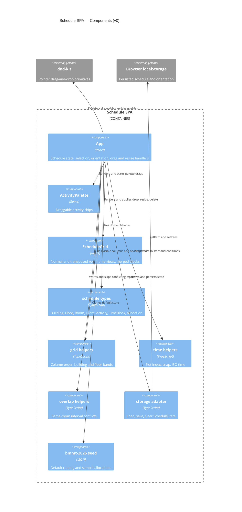

# Component (C4 level 3)

Logical components of the Schedule SPA. Palette and grid live in [`src/App.tsx`](../../src/App.tsx); domain helpers are separate modules.

## Data in memory

`ScheduleState` is the single in-memory model: event metadata, buildings, floors, rooms, activities, time blocks, and allocations. Allocations remain one row per room even when adjacent rooms are drawn as one merged block.

## UI modes

- **Normal:** time on Y, rooms on X, building/floor as column headers
- **Transposed:** rooms on Y, time on X, building/floor as row-spanning bands
