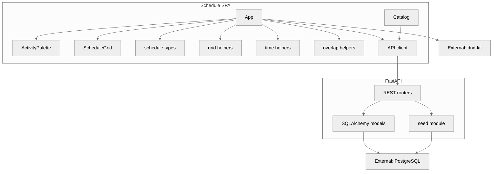

# Component (C4 level 3)

Logical components of the Schedule SPA and API. Grid UI lives in [`frontend/src/App.tsx`](../../frontend/src/App.tsx); catalog forms in [`frontend/src/Catalog.tsx`](../../frontend/src/Catalog.tsx).

## Data in memory

`ScheduleState` is still the SPA model: event metadata, buildings, floors, rooms, activities, time blocks, and allocations. It is loaded from `GET /api/v1/events/{id}/schedule` and mutated through allocation endpoints. Allocations remain one row per room even when adjacent rooms are drawn as one merged block.

## UI modes

- **Normal:** time on Y, rooms on X, building/floor as column headers
- **Transposed:** rooms on Y, time on X, building/floor as row-spanning bands
- **Catalog:** hash route `#/catalog` for buildings, floors, rooms, and event metadata
