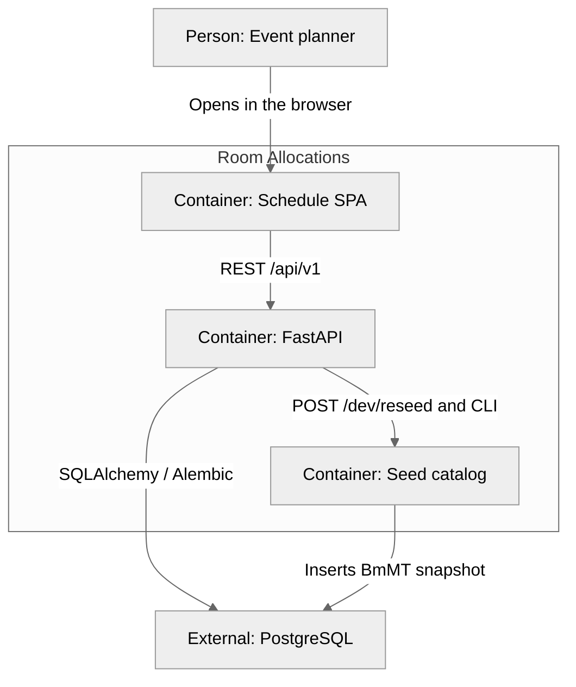

# Container (C4 level 2)

The Vite SPA talks to a FastAPI process. Postgres is the schedule store.

## Runtime

| Container | Technology | Role |
| --------- | ---------- | ---- |
| Schedule SPA | Vite + React 18 + TypeScript + `@dnd-kit` | Grid, catalog forms, orientation |
| FastAPI | Python 3, `/api/v1` | CRUD, overlap 409, composite schedule, atomic bulk allocation patch/delete |
| Seed catalog | `server/data/bmmt-2026.json` | Demo event snapshot |
| PostgreSQL | Postgres 16 (Docker Compose) | Source of truth |

Orientation is the only `localStorage` key. The schedule is not stored in the browser.
