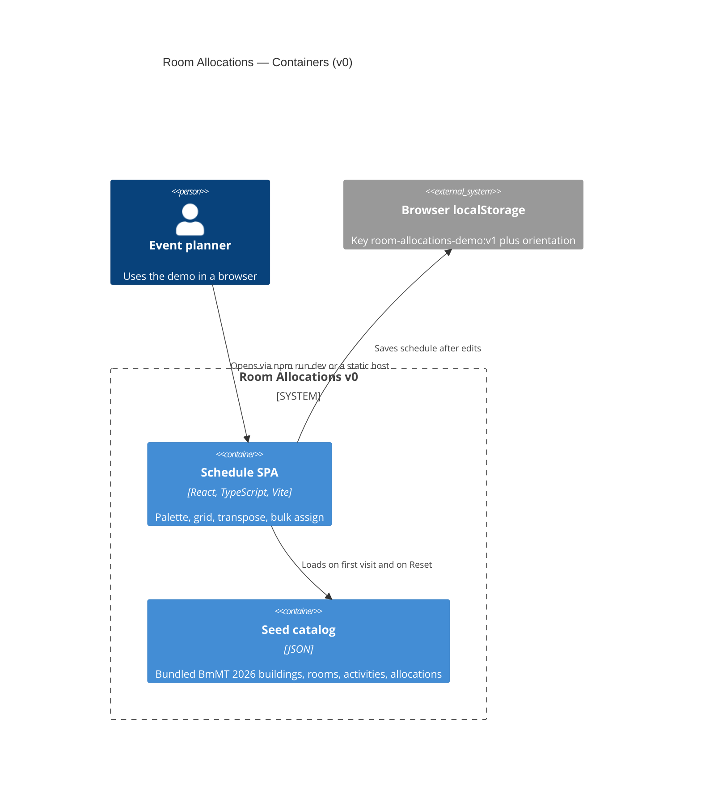

# Container (C4 level 2)

v0 ships as a static Vite SPA. Persistence is the browser, not a backend.

## Runtime

| Container | Technology | Role |
| --------- | ---------- | ---- |
| Schedule SPA | Vite + React 18 + TypeScript + `@dnd-kit` | All UI and scheduling logic |
| Seed catalog | `src/data/bmmt-2026.json` | Default event snapshot |
| Browser localStorage | Web Storage API | Last-edit persistence |

No API container, database, or auth service exists in v0.
