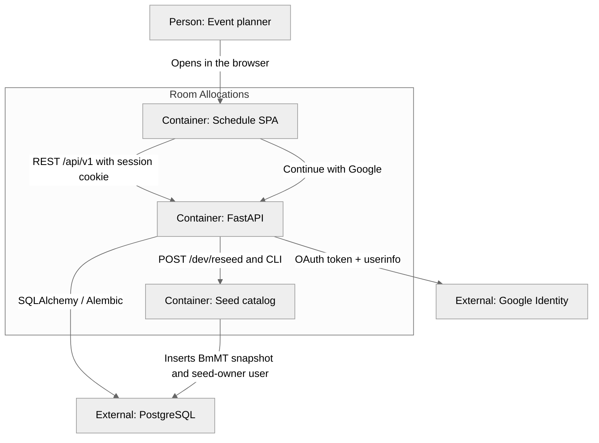

# Container (C4 level 2)

The Vite SPA talks to a FastAPI process. Postgres is the schedule store. Google is the identity provider for sign-in.

## Runtime

| Container | Technology | Role |
| --------- | ---------- | ---- |
| Schedule SPA | Vite + React 18 + TypeScript + `@dnd-kit` | Login, grid, catalog forms, orientation |
| FastAPI | Python 3, `/api/v1` | Session gate, Google OAuth, CRUD, overlap 409, composite schedule, atomic bulk allocation patch/delete |
| Seed catalog | `server/data/bmmt-2026.json` | Demo event snapshot; upserts `SEED_OWNER_EMAIL` with `google_sub` null until first Google login |
| PostgreSQL | Postgres 16 (Docker Compose) | Source of truth, including `users` |
| Google Identity | OAuth 2.0 authorization code | Sign-in; SPA never holds the client secret |

Orientation is the only `localStorage` key. The schedule is not stored in the browser. The session is an HTTP-only signed cookie (`ra_session`).
