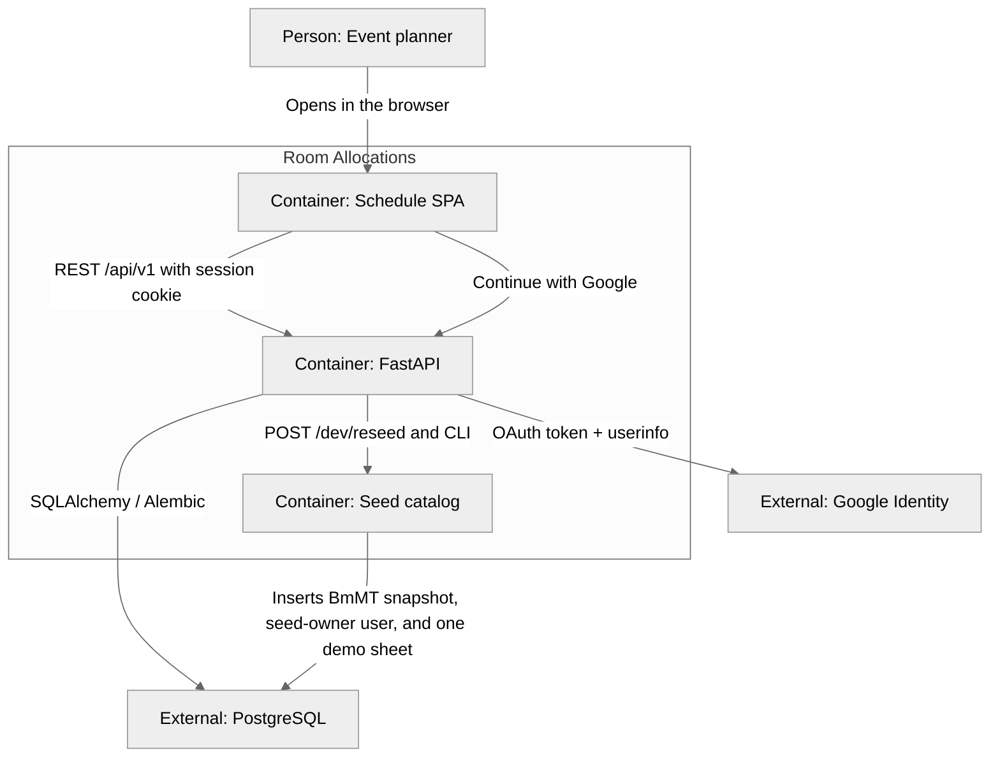

# Container (C4 level 2)

The Vite SPA talks to a FastAPI process. Postgres is the schedule store. Google is the identity provider for sign-in.

## Runtime

| Container | Technology | Role |
| --------- | ---------- | ---- |
| Schedule SPA | Vite + React 18 + TypeScript + `@dnd-kit` | Login, Event list, sheet wizard, owner grid, catalog forms, orientation |
| FastAPI | Python 3, `/api/v1` | Session gate, Google OAuth, CRUD, owner 404, overlap 409 per sheet, composite sheet schedule, atomic bulk allocation patch/delete |
| Seed catalog | `server/data/bmmt-2026.json` | Demo Event + one sheet for `SEED_OWNER_EMAIL`; upserts that user with `google_sub` null until first Google login |
| PostgreSQL | Postgres 16 (Docker Compose) | Source of truth, including `users` and `sheets` |
| Google Identity | OAuth 2.0 authorization code | Sign-in; SPA never holds the client secret |

Orientation and last Event id are the only `localStorage` keys. The schedule is not stored in the browser. The session is an HTTP-only signed cookie (`ra_session`).
