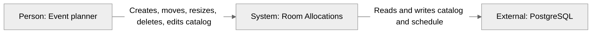

# Context (C4 level 1)

A single planner uses the app against a local API and Postgres. There is no auth or shared multi-user sync.

## Notes

- One planner at a time; the API is unauthenticated on localhost.
- Browser `localStorage` only stores grid orientation, not the schedule.
- Reset / reseed reloads the BmMT demo into Postgres.
