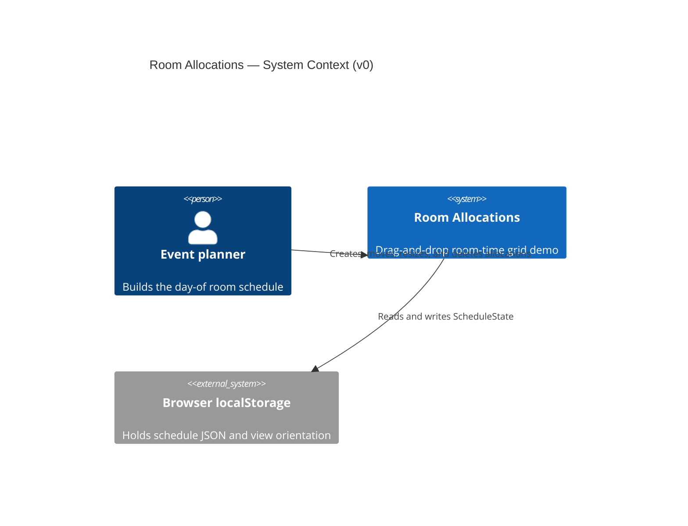

# Context (C4 level 1)

v0 is a single-user browser demo. There is no server, auth, or shared database.

## Notes

- One planner at a time per browser profile. There is no multi-user sync.
- Seed data is bundled in the app, not an external system.
- Reset clears localStorage and reloads the bundled seed.
