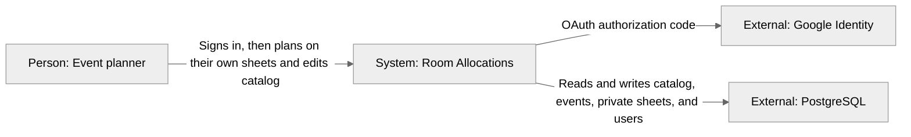

# Context (C4 level 1)

A planner signs in with Google (or a local dev login) and uses the app against a local API and Postgres. Catalog and Events are still global. Each allocations sheet is private to its owner. There is no org scoping or live multi-user sync.

## Notes

- `/api/v1` requires a session cookie except OAuth start/callback, auth config, logout, and (when enabled) `POST /dev/login`.
- `/health` stays public.
- Browser `localStorage` only stores grid orientation and the last Event id, not the schedule.
- Reset / reseed reloads the BmMT demo into Postgres and upserts the seed-owner user. It does not wipe `users`. The demo sheet belongs to `SEED_OWNER_EMAIL` only.
- A sheet (and its allocations) is **404** for anyone who is not the owner.
- Two sheets may book the same room at the same time; overlap 409 is per sheet.
- Google Cloud OAuth client stays in Testing; allowlist stakeholder Gmails. `ENABLE_DEV_AUTH` is a local bypass, off in production.
