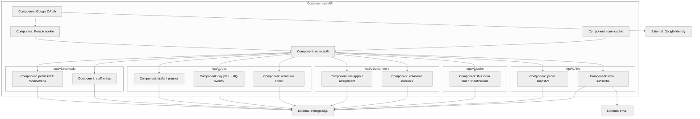
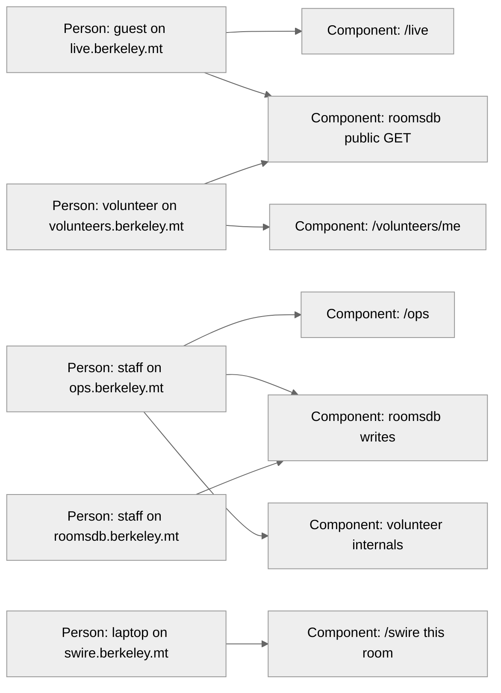

# Target C3: one API (not as-built)

**Status:** Target workshop picture. This is C4 **level 3 (component)** of the **one API** container locked in [integrated system](2026-08-24-integrated-system.md). It is **not** the prototype FastAPI in [docs/c4/component.md](../docs/c4/component.md). Stack (language, framework) is still open; boxes are folders and auth, not Python modules.

C2 (container) is still: browsers → **one API** → **one Postgres**. Hosts are six bookmarks, not six APIs.

## API internals

Five folders in **one process**. The gate is cookie + route. Prefixes name **who owns the tables**; they do not stop a live origin from calling `/roomsdb/` when that GET is on the public surface.

Staff volunteer routes live under **`/ops/` or `/volunteers/` once**, not both — pick in the volunteer module spec.

Day-of never writes rooms: only `roomsdbStaff` updates buildings/floors/rooms. Other folders **join** `rooms.id`.

## Who may call which surface

Allowed edges only. Missing edge = do not call (auth 401/404, not “the prefix hid it”).

Not on this picture (on purpose): guest → `/ops`, guest → volunteer people/DNI, Swire → roomsdb writes, Person cookie → Swire as if it were a room.

Contracts: [cross-module callers](2026-08-24-integrated-system.md#cross-module-callers-contracts-not-memos).
