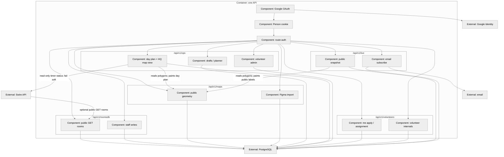
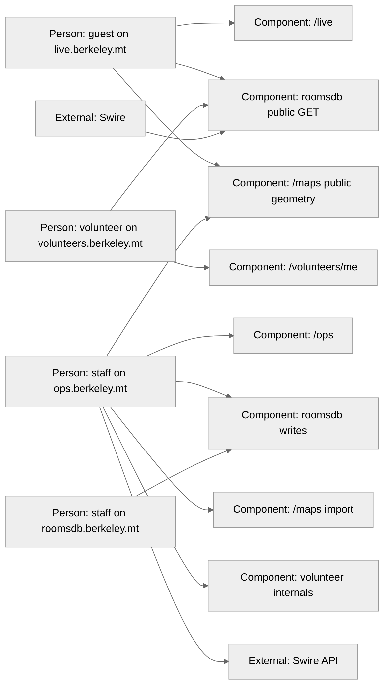

# Target C3: one API (not as-built)

**Status:** Target workshop picture. C4 **level 3 (component)** of the **one API** in [integrated system](2026-08-24-integrated-system.md). **Not** the prototype FastAPI in [docs/c4/component.md](../docs/c4/component.md).

**Swire is not a component of this API.** It is an external proctor suite that exposes its own HTTP API. **Maps are a folder of this API**, read by both HQ and live. Live stays inside this process so guests and officers share one geometry.

## API internals

Five folders in **one process**. The gate is the Person cookie (or none, for public live and public map geometry). There is no room cookie here. Maps are not inside `/live/`.

Staff volunteer routes live under **`/ops/` or `/volunteers/` once**, not both.

Day-of and Swire never write rooms: only `roomsdbStaff` updates buildings/floors/rooms.

## Who may call which surface

Not on this picture: guest → `/ops`, guest → Swire, live → Swire, Swire → roomsdb writes, Swire → `/volunteers`.

Contracts: [cross-module callers](2026-08-24-integrated-system.md#cross-module-callers-contracts-not-memos).
