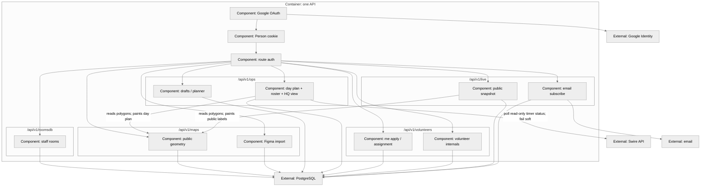
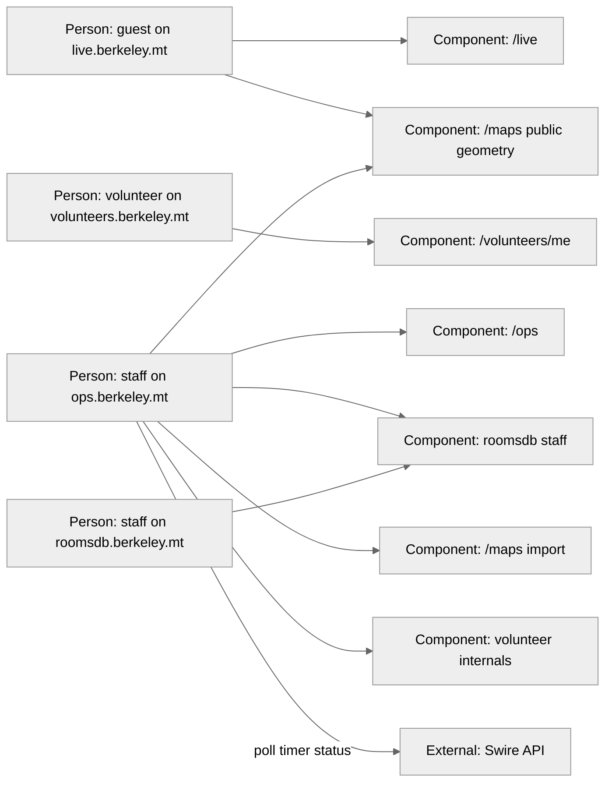

# Target C3: one API (not as-built)

**Status:** Target workshop picture. C4 **level 3 (component)** of the **one API** in [integrated system](2026-08-24-integrated-system.md).

**Swire is not a component of this API.** Swire admins are the only writers. Proctors cannot modify it. The exposed API is read-only; this platform polls it. **Maps are a folder of this API**, read by both HQ and live.

## API internals

Five folders in **one process**. The gate is the Person cookie (or none, for public live and public map geometry). There is no room cookie here. Maps are not inside `/live/`. Roomsdb has no unauthenticated GET. If the live or Swire builders later want room labels without a roomsdb login, add one small GET then. It is not a component on this picture.

```mermaid
%%{init: {"theme": "neutral"}}%%
flowchart TB
  subgraph api [Container: one API]
    googleAuth["Component: Google OAuth"]
    personSess["Component: Person cookie"]
    gate["Component: route auth"]
    subgraph roomsdbFolder ["/api/v1/roomsdb"]
      roomsdbStaff["Component: staff rooms"]
    end
    subgraph mapsFolder ["/api/v1/maps"]
      mapsPublic["Component: public geometry"]
      mapsStaff["Component: Figma import"]
    end
    subgraph opsFolder ["/api/v1/ops"]
      opsDrafts["Component: drafts / planner"]
      opsDay["Component: day plan + roster + HQ view"]
    end
    subgraph volFolder ["/api/v1/volunteers"]
      volMe["Component: me apply / assignment"]
      volInternal["Component: volunteer internals"]
    end
    subgraph liveFolder ["/api/v1/live"]
      liveSnap["Component: public snapshot"]
      liveSub["Component: email subscribe"]
    end
  end
  swire["External: Swire API"]
  google["External: Google Identity"]
  postgres["External: PostgreSQL"]
  mail["External: email"]
  googleAuth --> google
  googleAuth --> personSess
  personSess --> gate
  gate --> roomsdbStaff
  gate --> mapsPublic
  gate --> mapsStaff
  gate --> opsDrafts
  gate --> opsDay
  gate --> volMe
  gate --> volInternal
  gate --> liveSnap
  gate --> liveSub
  opsDay -->|"reads polygons; paints day plan"| mapsPublic
  liveSnap -->|"reads polygons; paints public labels"| mapsPublic
  opsDay -->|"poll read-only timer status; fail soft"| swire
  roomsdbStaff --> postgres
  mapsPublic --> postgres
  mapsStaff --> postgres
  opsDrafts --> postgres
  opsDay --> postgres
  volMe --> postgres
  volInternal --> postgres
  liveSnap --> postgres
  liveSub --> postgres
  liveSub --> mail
```

Staff volunteer writes live under **`/volunteers/`**, used from `volunteers.berkeley.mt/admin`. The HQ page does not call them.

Day-of and Swire never write rooms: only `roomsdbStaff` updates buildings/floors/rooms.

## Who may call which surface

```mermaid
%%{init: {"theme": "neutral"}}%%
flowchart LR
  liveHost["Person: guest on live.berkeley.mt"]
  volHost["Person: volunteer on volunteers.berkeley.mt"]
  staffOps["Person: staff on ops.berkeley.mt"]
  staffRooms["Person: staff on roomsdb.berkeley.mt"]
  roomsdbStaff["Component: roomsdb staff"]
  mapsPublic["Component: /maps public geometry"]
  mapsStaff["Component: /maps import"]
  opsAll["Component: /ops"]
  volMe["Component: /volunteers/me"]
  volInternal["Component: volunteer internals"]
  liveAll["Component: /live"]
  swireApi["External: Swire API"]
  liveHost --> liveAll
  liveHost --> mapsPublic
  volHost --> volMe
  staffOps --> opsAll
  staffOps --> roomsdbStaff
  staffOps --> mapsPublic
  staffOps --> mapsStaff
  staffOps --> volInternal
  staffOps -->|"poll timer status"| swireApi
  staffRooms --> roomsdbStaff
```

Not on this picture: guest → `/ops`, guest → `/roomsdb`, guest → Swire, live → Swire, Swire → this API, Swire → `/volunteers`. An unauthenticated rooms GET is not a component until the live or Swire builders ask for labels.

Contracts: [cross-module callers](2026-08-24-integrated-system.md#cross-module-callers-contracts-not-memos).
